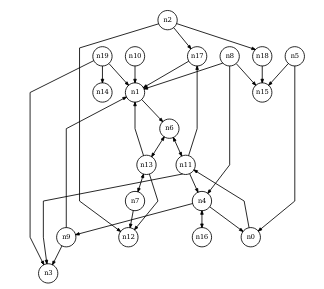

# demekgraph
This is a C++ graph library for directed graph layout visualization

The original is in the directory original with the sources in directory include  
The example draw program is in directory example  

To compile:  
mkdir build  
cd build  
cmake ..  
make  
  
to generate graph layout image of dot graph:  
./draw input.gv output.svg  
  
In directory updated there is a same version with few updates on the source code to get it compiled  
This library has sugiyama directed graph layout routines and brander placement routines  

The goal of this thesis is to implement a C++ library for creating visualizations of directed graphs.  
The library allows the user to create a graph by adding vertices and edges and create a hierarchical layout of this graph in space which is described by the positions of vertices and control points of edges.  
The thesis first gives an introduction to graph drawing, then the implemented algorithms are described in detail and the interface and usage of the library are illustrated on a sample application.  
The quality of drawings produced by the library is evaluated by comparing them with drawings produced by a popular graph drawing tool dot.  
For nodes with variable (x,y) sizes updates must be made and horizontal_compaction() must be done different  
The input dot graph only supports minimal part of dot language read the updated/example/draw/parser.hpp C++ source  
  
This is example of the generated svg images  

The License of the source is a MIT license  
  
